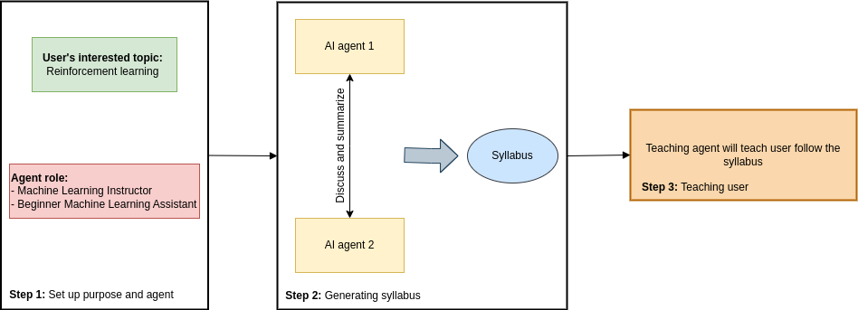

# 🤖 Agentic_Tutor: Your Personal AI Instructor

[](https://github.com/velanc-ai/Agentic_Tutor)
[](https://www.python.org/)
[](https://gradio.app/)

**Agentic_Tutor** is a next-generation AI-powered educational platform that uses multi-agent role-playing to design and deliver personalized learning experiences. Inspired by the [CAMEL](https://github.com/camel-ai/camel) architecture, it automates the process of syllabus creation and provides an interactive, adaptive instructor to guide you through any topic.

---

## 🚀 Overview

The project aims to revolutionize self-directed learning by harnessing the power of Large Language Models (LLMs). It features a unique three-agent workflow:
1. **Syllabus Discussion Agents**: Two agents (an Instructor and a Teaching Assistant) collaborate to brainstorm and structure a comprehensive syllabus based on your learning goals.
2. **Syllabus Generator**: A dedicated agent synthesizes the discussion into a structured course outline.
3. **Teaching Agent**: An adaptive instructor agent that follows the generated syllabus and teaches you topic-by-topic, ensuring you understand each concept before moving forward.

---

## ✨ Key Features

- **Collaborative Syllabus Design**: Uses multi-agent debate to ensure a well-rounded curriculum.
- **Adaptive Instruction**: The AI instructor adapts its style, pace, and depth to match your level.
- **Interactive UI**: A sleek [Gradio](https://gradio.app/) interface for easy interaction.
- **Open-Ended Learning**: Teach yourself anything from Machine Learning to International Trade.

---

## 🏗️ Architecture



1. **User Input**: Provide the topic you want to master.
2. **Agent Brainstorming**: Role-playing agents discuss core competencies and reading materials.
3. **Synthesis**: A LLM compiles the debate into a logical course roadmap.
4. **Teaching Phase**: The Instructor Agent leads you through the syllabus, providing explanations, formulas, and examples.

---

## 🛠️ Installation

### 1. Clone the Repository
```bash
git clone https://github.com/velanc-ai/Agentic_Tutor.git
cd Agentic_Tutor
```

### 2. Set Up Environment
We recommend using Python 3.10+.
```bash
# Using the provided Makefile
make venv
# OR manually
python -m venv venv
source venv/bin/activate  # On Windows: venv\Scripts\activate
pip install -r requirements.txt
```

### 3. Configuration
Create a `.env` file in the root directory and add your OpenAI API key:
```env
OPENAI_API_KEY=your_openai_api_key_here
```

---

## 📖 Usage

Run the Gradio app to start your learning journey:

```bash
python Agentic_Tutor/src/teaching_agent.py
```

1. **Input Your Topic**: Navigate to the "Input Your Information" tab and state what you want to learn.
2. **Review Syllabus**: The AI will generate a detailed syllabus for you.
3. **Start Learning**: Switch to the "AI Instructor" tab and begin the discussion!

---

## 🤝 Contributing

Contributions are welcome! Whether it's adding new agent roles, improving the UI, or optimizing the teaching logic, feel free to open a PR.

---

## 📧 Contact

**Author**: Velan C
**Email**: velanchennappan@gmail.com
**GitHub**: [@velanc-ai](https://github.com/velanc-ai)

---
*This project is not completely created by me there are many references that I have cloned to build this project - Kindly contact me for the reference *
